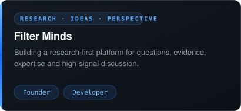
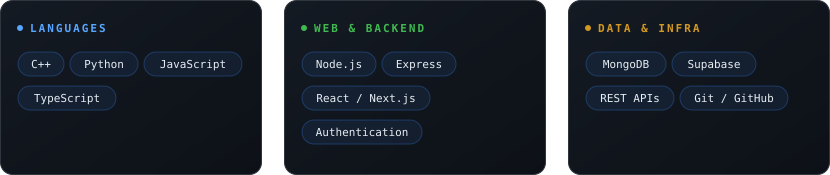
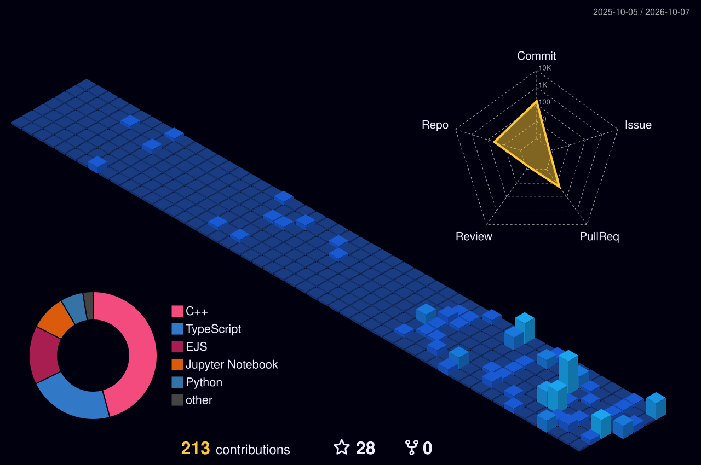

  

  <a href="https://github.com/aarav-pathak">GitHub</a> &nbsp;·&nbsp;
  <a href="https://filterminds.com">Filter Minds</a> &nbsp;·&nbsp;
  <a href="https://codeforces.com/profile/orthodoxcoder">Codeforces</a> &nbsp;·&nbsp;
  <a href="https://leetcode.com/u/orthodoxcoder/">LeetCode</a> &nbsp;·&nbsp;
  <a href="https://www.codechef.com/users/orthodoxcoder">CodeChef</a> &nbsp;·&nbsp;
  <a href="mailto:aaravpathak9984@gmail.com">Email</a>

  

<table align="center" border="0" cellpadding="0" cellspacing="8">
  <tr>
    <td align="center" valign="top">
       
      <a href="https://filterminds.com">Website (Live)</a>
    </td>
    <td align="center" valign="top">
       
      <a href="https://kaizen-mirai.vercel.app/">Live App</a> &nbsp;·&nbsp; <a href="https://github.com/aarav-pathak/tech_club_web">GitHub Repo</a>
    </td>
  </tr>
  <tr>
    <td align="center" valign="top">
       
      <a href="https://sheeter-nine.vercel.app/">Live App</a> &nbsp;·&nbsp; <a href="https://github.com/aarav-pathak/sheeter">GitHub Repo</a>
    </td>
    <td align="center" valign="top">
       
      <a href="https://tasky-seven-delta.vercel.app/auth">Live App</a> &nbsp;·&nbsp; <a href="https://github.com/aarav-pathak/TAsky">GitHub Repo</a>
    </td>
  </tr>
  <tr>
    <td align="center" valign="top">
       
      <a href="https://strangery.vercel.app/">Live App</a> &nbsp;·&nbsp; <a href="https://github.com/aarav-pathak/stranger_talk">GitHub Repo</a>
    </td>
    <td align="center" valign="top">
       
      <a href="https://closest.onrender.com">Live App</a> &nbsp;·&nbsp; <a href="https://github.com/aarav-pathak/closest">GitHub Repo</a>
    </td>
  </tr>
</table>

  

  

  

  
  &nbsp;
  

  

  

  

  <a href="https://codeforces.com/profile/orthodoxcoder">Codeforces</a> &nbsp;·&nbsp;
  <a href="https://leetcode.com/u/orthodoxcoder/">LeetCode</a> &nbsp;·&nbsp;
  <a href="https://www.codechef.com/users/orthodoxcoder">CodeChef</a>

  

  <strong><a href="https://filterminds.com">Filter Minds</a></strong> 
  A platform for better questions, clearer perspectives and evidence-first discussion. 
  Currently focused on: Product Engineering · Research Systems · AI · Community

  

  <a href="https://github.com/aarav-pathak">GitHub</a> &nbsp;·&nbsp;
  <a href="https://codeforces.com/profile/orthodoxcoder">Codeforces</a> &nbsp;·&nbsp;
  <a href="https://leetcode.com/u/orthodoxcoder/">LeetCode</a> &nbsp;·&nbsp;
  <a href="https://www.codechef.com/users/orthodoxcoder">CodeChef</a> &nbsp;·&nbsp;
  <a href="mailto:aaravpathak9984@gmail.com">Email</a>

  Build deliberately. Ship continuously.

