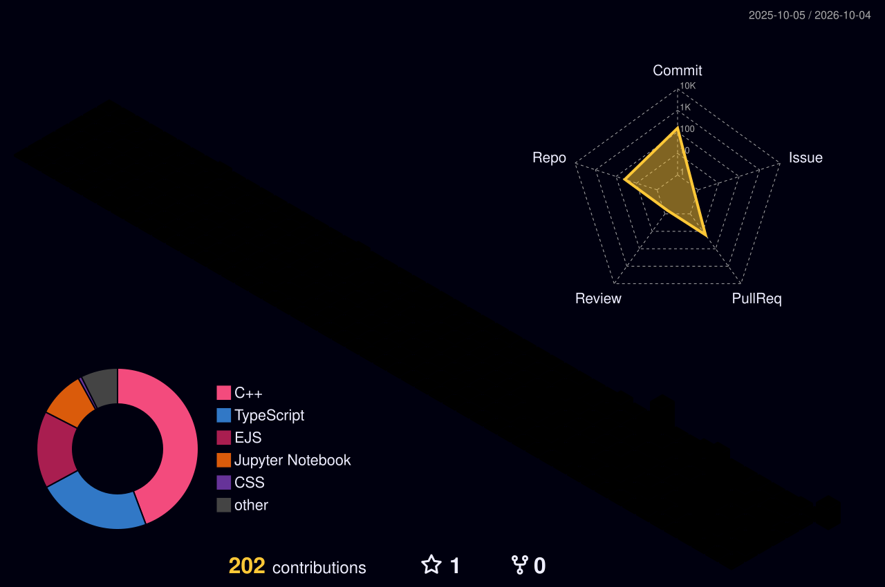

 

<!--- RADAR & FOCUS --->

 

 

 

<!--- SELECTED WORK --->

 

<table width="100%" cellspacing="0" cellpadding="0" border="0">
<tr>
<td width="50%" valign="top" align="left">

</td>
<td width="50%" valign="top" align="right">

</td>
</tr>
<tr>
<td colspan="2" valign="top">
 
</td>
</tr>
<tr>
<td width="50%" valign="top" align="left">

</td>
<td width="50%" valign="top" align="right">

</td>
</tr>
<tr>
<td colspan="2" valign="top">
 
</td>
</tr>
<tr>
<td width="50%" valign="top" align="left">

</td>
<td width="50%" valign="top" align="right">

</td>
</tr>
</table>

 

 

<!--- ENGINEERING & PRINCIPLES --->

 

 

 

 

<!--- GITHUB ACTIVITY --->

 

 

 

 

<!--- COMPETITIVE PROGRAMMING --->

 

 

 

<!--- ELSEWHERE --->

 

&nbsp;

&nbsp;

&nbsp;

 

