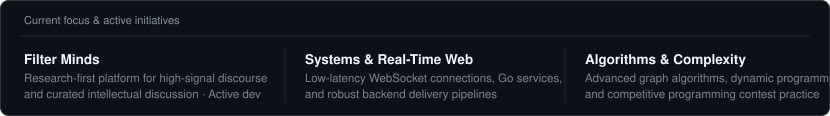
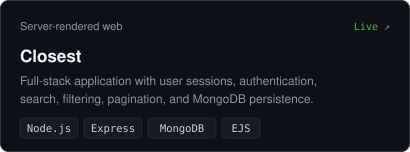
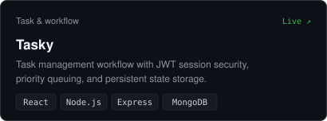
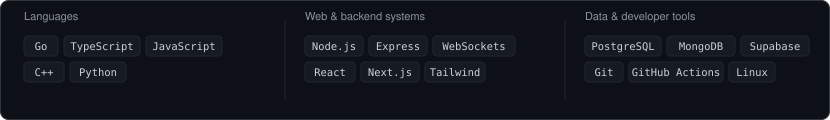
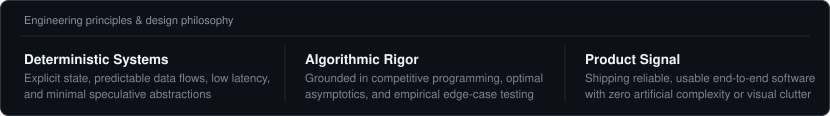
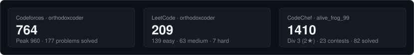

  

 

<!--- CURRENT FOCUS --->

  

 

  

 

<!--- SELECTED WORK --->

  

 

<table width="100%" cellspacing="0" cellpadding="0" border="0">
<tr>
<td width="50%" valign="top" align="left">

[](https://filterminds.com)

</td>
<td width="50%" valign="top" align="right">

[](https://kaizen-mirai.vercel.app/)

</td>
</tr>
<tr>
<td colspan="2" valign="top">
 
</td>
</tr>
<tr>
<td width="50%" valign="top" align="left">

[](https://strangery.vercel.app/)

</td>
<td width="50%" valign="top" align="right">

[](https://closest.onrender.com)

</td>
</tr>
<tr>
<td colspan="2" valign="top">
 
</td>
</tr>
<tr>
<td width="50%" valign="top" align="left">

[](https://sheeter-nine.vercel.app/)

</td>
<td width="50%" valign="top" align="right">

[](https://tasky-seven-delta.vercel.app/auth)

</td>
</tr>
</table>

 

<!--- ENGINEERING & PRINCIPLES --->

  

 

  

 

  

 

<!--- GITHUB ACTIVITY --->

  

 

  <a href="https://github.com/aarav-pathak">
    
  </a>

 

<!--- COMPETITIVE PROGRAMMING --->

  

 

  <a href="https://codechef.com/users/alive_frog_99">
    
  </a>

 

<!--- CONNECT --->

  

 

&nbsp;

&nbsp;

&nbsp;

&nbsp;

&nbsp;

